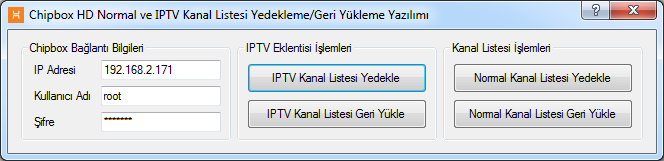
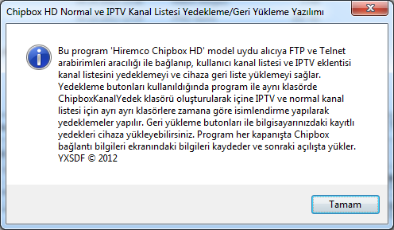
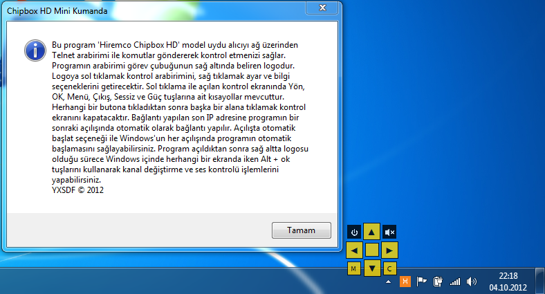
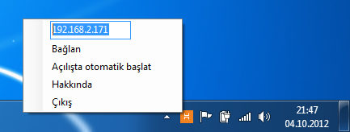

Chipbox HD Uydu Alıcısı Yedekleme ve Kontrol Yazılımları
========================================================

Bu proje, Hiremco Chipbox HD model ARM Linux tabanlı uydu alıcısına FTP ve Telnet arabirimi üzerinden bağlanarak cihazdaki bilgileri yedeklemeyi ve cihazı kumanda etmeyi sağlar. Programlar Visual Studio 2012 tümleşik geliştirme ortamı kullanılarak C# 4.0 programlama dili ile yazılmıştır.

Proje de iki temel yazılım mevcuttur. Bunlar, yedekleme ve kumanda yazılımlarıdır. Aşağıda her bir programın detaylı açıklaması verilmiştir.

Chipbox HD Normal ve IPTV Kanal Listesi Yedekleme/Geri Yükleme Yazılımı
-----------------------------------------------------------------------
Program arayüzünde Chipbox bağlantı bilgileri ekranına cihazın IP adresi ve Telnet/FTP kullanıcı adı ve şifre bilgisi girildikten sonra IPTV ve normal kanal listesi için ayrı ayrı yedekleme butonları kullanılarak yedekleme yapılabilir. Yedeklemeler, programın .exe dosyasının olduğu klasörde .exe dosyası ile aynı isimde bir klasör oluşturularak, klasörün içine yapılmaktadır. IPTV ve normal kanal listeleri ayrı klasörlere ve dosya isimleri de tarih damgalı olarak yedeklenmektedir. Yedekleme işlemi tamamlanınca oluşturulan dosyanın tam yolu mesaj kutusu aracılığıyla gösterilmektedir.

* Program arayüzü aşağıda görülebilir.

* Programın içindeki yardım ekranı kullanım ile ilgili temel bilgileri içermektedir.

Program her kapanışta son kayıtlı ayarları bir sonraki açılışta hatırlamak üzere kaydeder.

Program, FTP erişimi için [System.Net.FtpClient](http://netftp.codeplex.com/) harici kütüphanesini kullanmaktadır. Bunun amacı .NET BCL de bulunan FTP erişim kütüphanesinden daha hızlı ve kararlı çalışmasıdır.

Program ile ilgili olarak, uydu alıcıları ve teknolojileri konusunda Türkiye'deki en büyük forum olan TurkeyForum'daki başlığa [bu bağlantı](http://www.turkeyforum.com/satforum/showthread.php?t=694992)dan ulaşılabilir.

Chipbox HD Mini Kumanda
-----------------------
Mini kumandanın temel amacı, Chipbox HD uydu alıcısına temel uzaktan kumanda kontrollerini göndermektir. Bunu yaparken de arayüz tasarımında en küçük alan ile en etkili kullanımı amaçlamaktadır. Programın, açıldığında herhangi bir görsel arayüzü bulunmamaktadır. Sadece görev çubuğunda ki simge aktif olur ve bağlantı durumunu belirten bir bilgi balonu görünür.

Program cihaza bağlanmak için uydu alıcıya Telnet (TCP) bağlantısı yapar. Ayrıca olası bağlantı kopması durumunda otomatik olarak tekrar bağlanacak şekilde programlanmıştır.

Program simgesine sol tıklayarak program arayüzüne, sağ tıklayarak ise ayar menüsüne erişilmektedir. Program arayüzünün kapanması için arayüze tıklandıktan sonra ekranda herhangi başka bir noktaya tıklamak yeterlidir. Programın arayüzünde uydu alıcının temel kontrol tuşları vardır, bunlar: Aşağı, yukarı, sola, sağa, kapat, sessiz, menü ve çıkış tuşlarıdır. Ayar menüsünde ise IP adresi giriş kutusu, bağlantı ve otomatik açılış seçenekleri vardır. Bağlantı ve otomatik açılış butonlarının yanında durumlarına göre (bağlı ise ya da otomatik açılış devrede ise) onay işareti görünmektedir. IP adresi ve diğer seçimler program kapanırken kaydedilerek bir sonraki açılışta tekrar yüklenir.

Ayrıca, kullanım kolaylığı için programın arayüzüne ulaşmadan, herhangi bir anda klavye kısayollarını kullanarak cihaza komutlar göndermek mümkündür. Klavyeden Alt + [Yön tuşları] kullanılarak cihaza kumandadaki yön tuşları komutları (sol-sağ: ses kontrolü, aşağı-yukarı: kanal değiştirme) olduğu gibi hızlıca gönderilebilir. Bu özelliği sağlamak için Win32 API'sini kullanan harici [System Hotkey Component](http://www.codeproject.com/Articles/3055/System-Hotkey-Component) kütüphanesi kullanılmıştır.

Aşağıda programın örnek arayüzü mevcuttur.

* Program arayüzü ve hakkında ekranı birlikte görünmekte.

* Simgeye sağ tık yapınca açılan ayar ekranı:

Program ile ilgili olarak, uydu alıcıları ve teknolojileri konusunda Türkiye'deki en büyük forum olan TurkeyForum'daki başlığa [bu bağlantı](http://www.turkeyforum.com/satforum/showthread.php?t=694928)dan ulaşılabilir.

